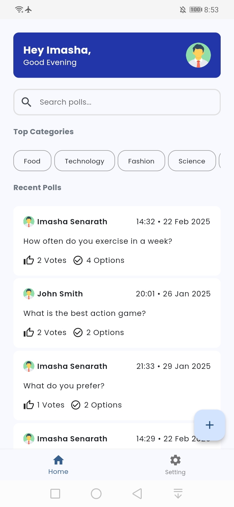
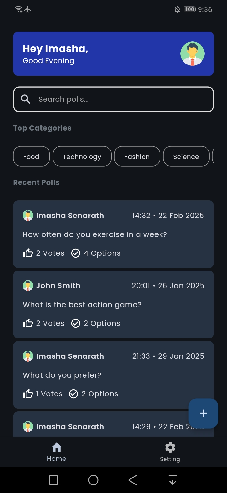
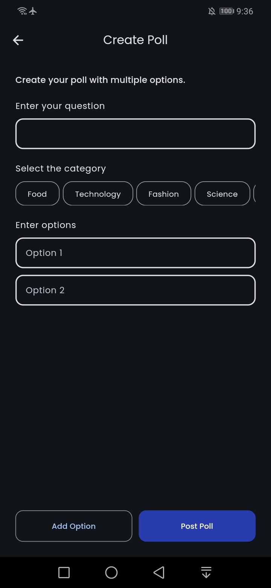
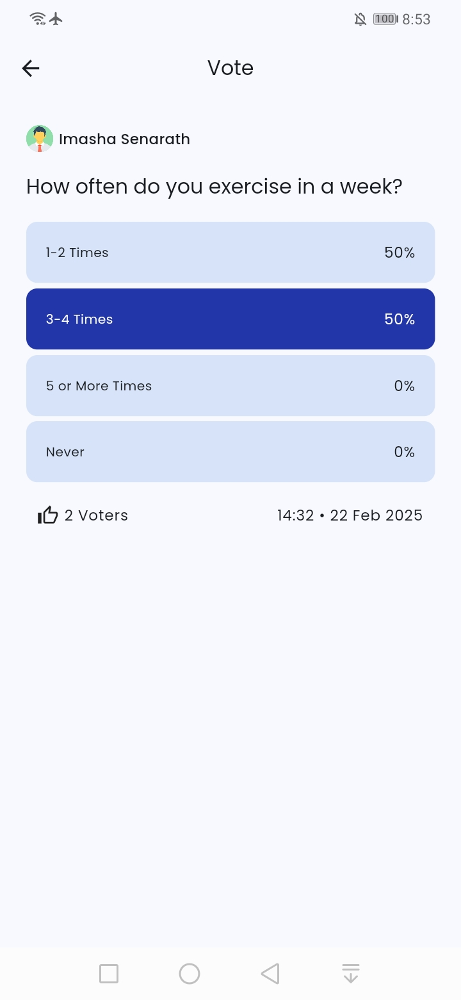
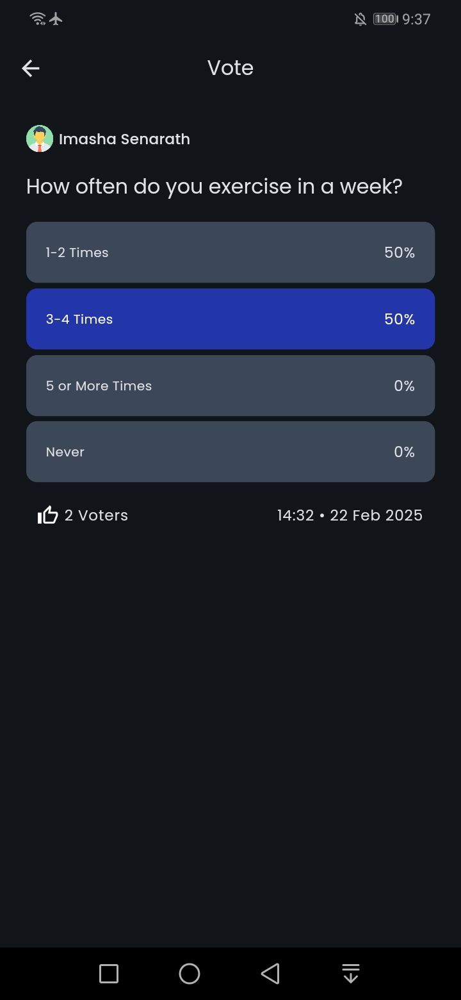

<h1> Votez </h1>

A Flutter social media app for creating and participating in polls. Users can engage in discussions, vote on trending topics, and explore polls across various categories. Built with Clean Architecture, BLoC, and Firebase.

<h2> ⚙️ Technologies </h2>
<ul>
  <li>Flutter with Clean Architecture and BLoC Pattern.</li>
  <li>Firebase with Authentication and Firestore.</li>
  <li>Dependency Injection.</li>
</ul>

<h2> 🔥 Features </h2>
<ul>
  <li>Create polls with multiple options, including anonymous posting.</li>
  <li>Vote on polls created by others.</li>
  <li>Search polls by keywords or categories.</li>
  <li>Explore trending and categorized polls.</li>
  <li>Light and dark mode support.</li>
</ul>

<h2>🛢️ Set Up Database</h2>

This project uses Firebase, but the current Firebase account has been disabled due to spamming, so the app won’t work. To make it functional, create a new Firebase project, add the Android app, and generate the google-services.json file. Place it in the android/app/ directory. Then, enable Email Authentication and Firestore Database in your Firebase project.

  
<h2> 📸 Screenshots </h2>

 

 

 

 

 

To see all screenshots, check the "ss" folder.

<h2> 👽 Author </h2>

Developed by <strong>TunaSoft Tech</strong>

<ul>
  <li>Tunahan Coşgun &lt;info@tunahancosgun.dev&gt;</li>
  <li>Duygu Durmuş &lt;duygudurmus12@gmail.com&gt;</li>
</ul>

<h2> 📄 License </h2>

Distributed under the MIT License. See <a href="./LICENSE"><code>LICENSE</code></a> for more information.

Copyright © 2026 TunaSoft Tech

<h2> © Credits </h2>

All icons, images, and other media used in this project are the property of their respective copyright owners. Their rights are fully acknowledged and respected.
